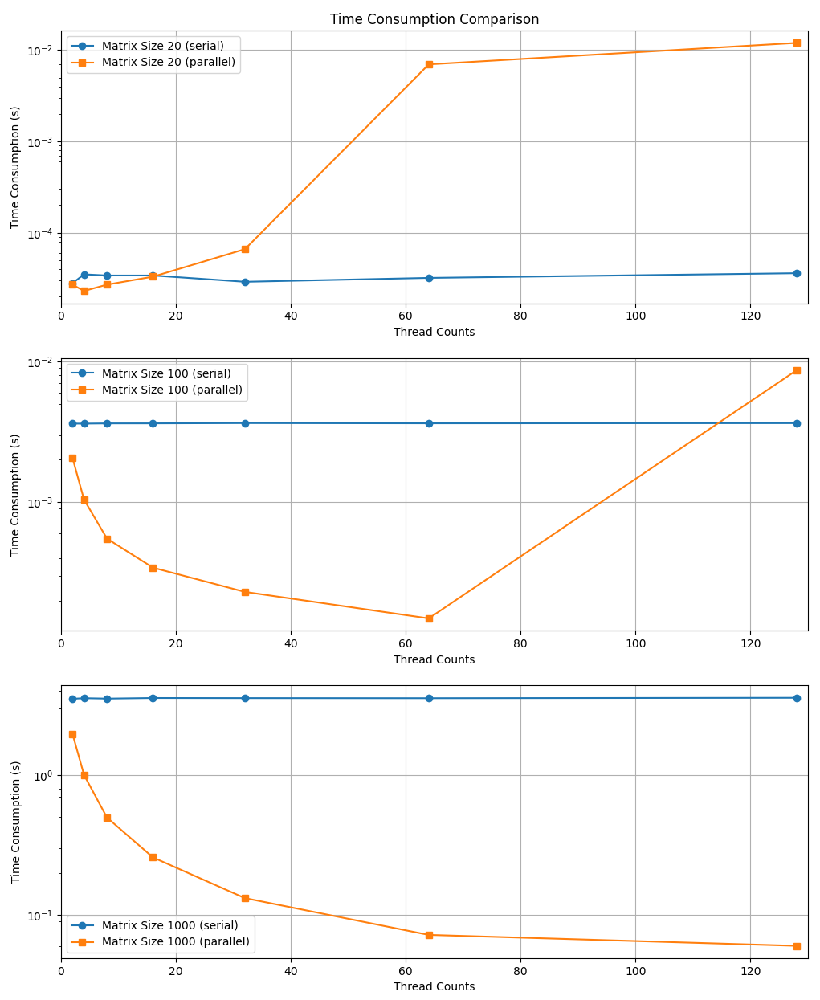

# 
 CMSE 822 &nbsp;&nbsp;&nbsp; SS24
## 
  Project 4 OpenMP and Hybrid Parallelism

  &#9786; Team 1  

  Benjamin DalFavero, Reza Khan Mohammadi, Tairan Song, Xiaotian Hua, Ziyu Cheng
  

## Part 1 : OpenMP Matrix-Matrix Multiplication

### Q2 
As shown in the figure below, when we run the MMM program on `amd-20` using `export OMP_NUM_THREADS=1`, the time consumed is almost the same as that for serial computing of MMM. When the matrix size is very small, the error is more noticeable, but still less than 3%. The reason for the minor discrepancies is that running OMP code also requires time, but as the scale of computation increases, the proportion of this time becomes smaller and smaller.

### Q3 
In `AMD-20`, using the `nproc` command to query the maximum number of processes is `128`, so T=128.
The results of MMM in size `N=20,100,1000` under multiple OMP threads are shown in the figure below. As the number of threads doubles, the time taken for matrix multiplication also decreases exponentially, until the number of threads exceeds the matrix size. When the number of threads is greater than the size of the matrix, increasing the number of threads actually increases the computation time.

## Part 2 : Adding OpenMP threading to a simple MPI application

Please see code in file `src/part2_hello_omp.c`.  

- **Output**  

- **Comments**  

(1) We modify the `MPI_Init` call into `MPI_Init_thread(&argc, &argv, MPI_THREAD_SINGLE, &provided)` to allow for threads. We use the lowest level of thread support. In this simple `hello` program, `MPI_THREAD_SINGLE` might suffice because the parallel region only performs outputing "hello world" messages without involving MPI communication inside the parallel region. In summary, the necessity of using which level of thread support depends on how the MPI calls interact with the multi-threaded sections of the program.  

(2) This simple `hello` program running with both MPI (process-level parallelism) and OpenMP (thread-level parallelism).  

*"Before 'MPI_Init': Hello, world."*:   
This message is printed twice, once by each of the two MPI processes started by mpiexec with -n 2. It appears before MPI is initialized in the program, so at this point, the program does not have any MPI-related context such as rank or number of tasks.  

*"Between 'MPI': Hello, World ~ ..."*   
This message is printed by each thread of the OpenMP parallel regions within each MPI process after `MPI_Init` has been called. The output indicates that we have two MPI processes (rank 0 and rank 1) as specified by the `-n 2` argument. Each process is running 4 threads (0 through 3), given the OpenMP environment variable `OMP_NUM_THREADS=4`.   

*"After 'MPI_Finalize': Hello, World!!!"*   
This message is printed twice, corresponding to the two MPI processes, after the MPI environment has been finalized. No more MPI operations will occur after this point.

## Part 3: Hybrid Parallel Matrix Multiplication

